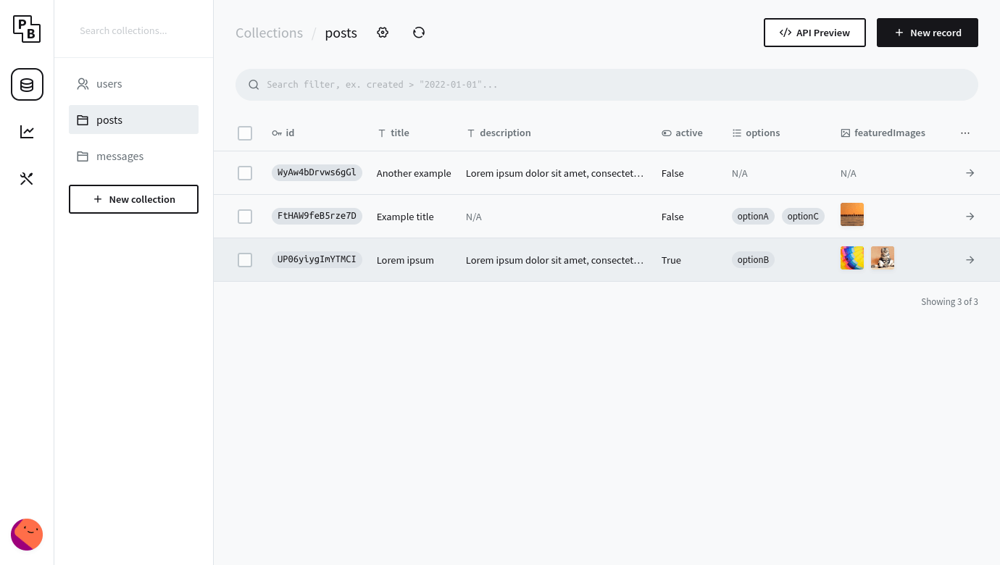

# PocketBase Agent CI/CD pipeline

Deploy PocketBase with CI/CD on Elestio

 
 

# When deploying ...

You can open PocketBase UI here:

    URL: https://[CI_CD_DOMAIN]
    Login: root
    password: [ADMIN_PASSWORD]

# Additional configuration

Once connected, you will need to configure the application url, to do that go to:

    https://[CI_CD_DOMAIN]/_/#/settings

There set a name for your application and in the Application URL field paste `[CI_CD_DOMAIN]` and save

Then finally go to mail settings: 

    https://[CI_CD_DOMAIN]/_/#/settings/mail

**Fill in the below details:**

**Step 1**: Enter `[DOMAIN]@vm.elestio.app` in the Sender address field.
            
    Here [DOMAIN] will be your service cname.
            
**Step 2**: Enable the SMTP mail server toggle switch and fill in the configuration like this:

    SMTP SERVER HOST: 172.17.0.1
    PORT: 25
    TLS ENCRYPTION: AUTO
    USERNAME: (leave empty)
    PASSWORD: (leave empty)

Then save and send a test email to yourself 

# Full documentation

    https://pocketbase.io/docs/
